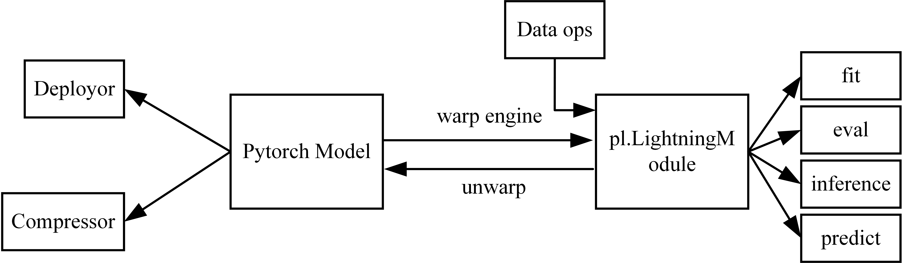

# Engine

Tiny3D uses a warp engine for the pytorch model to train and evaluate, and the trained parameters can be extracted for deployment and compression. The relationship between the engine and the other modules is shown in the following diagram.



We built Pytorch Lighting Module for pointpillars, You can refer to [PyTorch Lightning](https://www.pytorchlightning.ai/) to build your model.

```python
class Pointpillars_engine(pl.LightningModule):
	def __init__(self):
		# define pytorch networks.
        
    def init_weights(self):
        # define pytorch network init.
    
    def forward(self, img_metas, points):
        # define the full inference process for an image. Note that this function is not used in training and validation, but               only when it is called explicitly.

	def configure_optimizers(self):
        # define optimizers and learning rate control strategies

	def training_step(self, train_batch, batch_idx):
        # Define the forward process of a batch during training and how to calculate the loss

	def validation_step(self, val_batch, batch_idx):
        # Defining the forward and post-processing of a batch when evaluate
		
    def validation_epoch_end(self, outputs):
        # how to calculate metrics for all results
        
    def predict_step(self, batch, batch_idx, dataloader_idx=0):
        # define the forward and post-processing of a batch when reasoning
```


After defining the Pytorch model, we wrap it into a Pytorch Lighting model as:

```python
torch_model = Pointpillars()
model = Pointpillars_engine(torch_model)
```


## Usage

You should first install Pytorch Lighting as:

```shell
pip install pytorch-lightning
```

Then prepare Kitti dataset first as https://github.com/open-mmlab/mmdetection3d/blob/master/docs/zh_cn/datasets/kitti_det.md


We offer five ways to use it:

**fit**: train from scratch or fine-tune your pytorch model

**eval**:  evaluate your pytorch model and calculate metrics

**predict**: inference a batch of point cloud data

**inference**: inference a point cloud data

**infer_production**: unwarp Pytorch Lighting model to get the Pytorch model, and then infer a point cloud data


You can execute scripts as:

```shell
python tools/engines.py
--model_name
pointpillars
--mode
fit
--config
engine/pointpillars_160e_kitti-3d-car.py
```


You can download our pointpillar network trained using pytorch lighing from [best-epoch=159-ap=76.5387.ckpt](https://drive.google.com/file/d/1GhOuRm_9DOR7FWSKxO-5NMPYO2SfkJNh/view?usp=sharing)


## Extension

**For Deployor or Compressor:**

You can wrap the Pytorch model into a Pytorch Lighting model for training. After training, you can unwarp it in the following way to get the Pytorch model for deployment or compression.

```python
checkpoint = torch.load("lightning_logs/version_9/checkpoints/epoch=3-step=14848.ckpt")
state_dict = checkpoint["state_dict"]

# update keys by dropping `torch_model.`
for key in list(state_dict):
     state_dict[key.replace("torch_model.", "")] = state_dict.pop(key)

torch_model.load_state_dict(state_dict)
```


**For Data ops:**

You can add data ops to the data pipeline in the configuration file for training or evaluation. 

**Note**: You need the function that converts data ops to [mmdet3d](https://github.com/open-mmlab/mmdetection3d) format.

We have converted some data ops into the above format and added them to the configuration file, you can refer to them.

```python
@PIPELINES.register_module()
class DataFilter(object):

    def __init__(self, method='remove_statistical_outlier', params={"nb_neighbors" : 20, "std_ratio" : 0.05}):
        self.method = method
        self.params = params

    def remove_statistical_outlier(self, lidar_data, nb_neighbors, std_ratio):

        return filtered_lidar_data

    def remove_radius_outlier(self, lidar_data, nb_points, radius):

        return filtered_lidar_data

    def voxel_down_sample(self, lidar_data, voxel_size):

        return filtered_lidar_data


    def __call__(self, results):

        return results
```


```python
train=dict(
        type='KittiDataset',
        data_root='kitti/',
        ann_file='kitti/kitti_infos_train.pkl',
        split='training',
        pts_prefix='velodyne_reduced',
        pipeline=[
            dict(type='RandomFlip3D', flip_ratio_bev_horizontal=0.5),
            dict(
                type='DataFilter',
                method='remove_statistical_outlier',
                params={"nb_neighbors": 20, "std_ratio": 0.05}),
```
